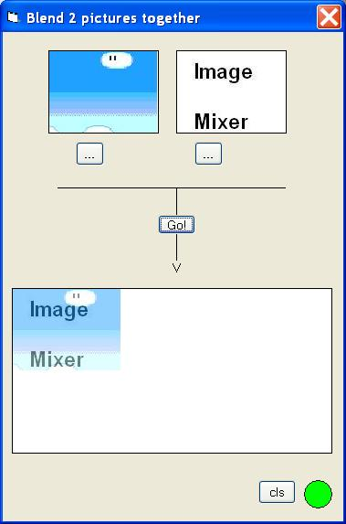



## Blend 2 images \(or more\) together

### Description

Blends 2 images together. Easy to add more images
 
### More Info
 

             |
---                |---
**Submitted On**   |2005-07-19 17:25:44
**By**             |[Angel Software](https://github.com/Planet-Source-Code/PSCIndex/blob/master/ByAuthor/angel-software.md)
**Level**          |Intermediate
**User Rating**    |4.3 (13 globes from 3 users)
**Compatibility**  |VB 6\.0
**Category**       |[Graphics](https://github.com/Planet-Source-Code/PSCIndex/blob/master/ByCategory/graphics__1-46.md)
**World**          |[Visual Basic](https://github.com/Planet-Source-Code/PSCIndex/blob/master/ByWorld/visual-basic.md)
**Archive File**   |[Blend\_2\_im1915227192005\.zip](https://github.com/Planet-Source-Code/angel-software-blend-2-images-or-more-together__1-61789/archive/master.zip)

